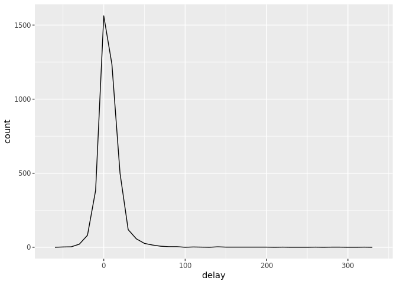

Data Transformation Notebook
================
Kourtney Burger
10/1/2019

5.1 Introduction
----------------

We use data transformations when we need to get data in the exact form we need in order to analyze it. We will often need to create new variables or summaries, or maybe just rename or reorder the observations.

### 5.1.1 Prerequisites

``` r
library(nycflights13)
library(tidyverse)
```

    ## Registered S3 method overwritten by 'dplyr':
    ##   method               from  
    ##   as.data.frame.tbl_df tibble

    ## Registered S3 methods overwritten by 'ggplot2':
    ##   method         from 
    ##   [.quosures     rlang
    ##   c.quosures     rlang
    ##   print.quosures rlang

    ## ── Attaching packages ───────────────────────────────────────── tidyverse 1.2.1 ──

    ## ✔ ggplot2 3.0.0     ✔ purrr   0.2.5
    ## ✔ tibble  1.4.2     ✔ dplyr   0.7.6
    ## ✔ tidyr   0.8.3     ✔ stringr 1.3.1
    ## ✔ readr   1.1.1     ✔ forcats 0.3.0

    ## ── Conflicts ──────────────────────────────────────────── tidyverse_conflicts() ──
    ## ✖ dplyr::filter() masks stats::filter()
    ## ✖ dplyr::lag()    masks stats::lag()

> If I want to use the base versions of the functions that have been overwritten, I need to use their full names: stats::filter() and stats::lag().

### 5.1.2 nycflights13

Data frame contains all 336,776 flights that departed from NYC in 2013.

> int stands for integers
> dbl stands for doubles, or real numbers
> chr stands for character vectors, or strings
> dttm stands for date-times (a date + a time).

### 5.1.3 dplyr basics

We are going to learn and use the five key dplyr functions that allow you to solve the vast majority of data manipulation challenges
&gt;Pick observations by their values (filter())
&gt;Reorder the rows (arrange())
&gt;Pick variables by their names (select())
&gt;Create new variables with functions of existing variables (mutate())
&gt;Collapse many values down to a single summary (summarise())

All of these functions work similarly: 1. The first argument is a data frame 2. The subsequent arguments describe what to do with the data frame, using the variable names (without quotes) 3. The result is a new dataframe

5.2 Filter rows with filter()
-----------------------------

The filter function allows me to subset observations based on their values.

For example, we can select all flights on January 1st with:

``` r
filter(flights, month == 1, day == 1)
```

    ## # A tibble: 842 x 19
    ##     year month   day dep_time sched_dep_time dep_delay arr_time
    ##    <int> <int> <int>    <int>          <int>     <dbl>    <int>
    ##  1  2013     1     1      517            515         2      830
    ##  2  2013     1     1      533            529         4      850
    ##  3  2013     1     1      542            540         2      923
    ##  4  2013     1     1      544            545        -1     1004
    ##  5  2013     1     1      554            600        -6      812
    ##  6  2013     1     1      554            558        -4      740
    ##  7  2013     1     1      555            600        -5      913
    ##  8  2013     1     1      557            600        -3      709
    ##  9  2013     1     1      557            600        -3      838
    ## 10  2013     1     1      558            600        -2      753
    ## # ... with 832 more rows, and 12 more variables: sched_arr_time <int>,
    ## #   arr_delay <dbl>, carrier <chr>, flight <int>, tailnum <chr>,
    ## #   origin <chr>, dest <chr>, air_time <dbl>, distance <dbl>, hour <dbl>,
    ## #   minute <dbl>, time_hour <dttm>

> This gives us a new data frame, we need to save the result if we want to use it

``` r
jan1 <- filter(flights, month == 1, day == 1)
```

### 5.2.1 Comparisons

You need to use == in order to run this code correctly, not just =

### 5.2.2 Logical Operators

Many arguments with filter are combined with and or or. You can use boolean operators for this
&gt;& is “and”, | is “or”, and ! is “not”

This code finds all the flights that departed in November OR December

``` r
filter(flights, month == 11 | month == 12)
```

    ## # A tibble: 55,403 x 19
    ##     year month   day dep_time sched_dep_time dep_delay arr_time
    ##    <int> <int> <int>    <int>          <int>     <dbl>    <int>
    ##  1  2013    11     1        5           2359         6      352
    ##  2  2013    11     1       35           2250       105      123
    ##  3  2013    11     1      455            500        -5      641
    ##  4  2013    11     1      539            545        -6      856
    ##  5  2013    11     1      542            545        -3      831
    ##  6  2013    11     1      549            600       -11      912
    ##  7  2013    11     1      550            600       -10      705
    ##  8  2013    11     1      554            600        -6      659
    ##  9  2013    11     1      554            600        -6      826
    ## 10  2013    11     1      554            600        -6      749
    ## # ... with 55,393 more rows, and 12 more variables: sched_arr_time <int>,
    ## #   arr_delay <dbl>, carrier <chr>, flight <int>, tailnum <chr>,
    ## #   origin <chr>, dest <chr>, air_time <dbl>, distance <dbl>, hour <dbl>,
    ## #   minute <dbl>, time_hour <dttm>

### 5.2.3

NA values can make comparisons tricky
&gt;if you want to check for missing values use this code
is.na(x)

### 5.2.4 Excersizes

1.  Find all flights that
    &gt;Had an arrival delay of two or more hours
    &gt;Flew to Houston (IAH or HOU)
    &gt;Were operated by United, American, or Delta
    &gt;Departed in summer (July, August, and September)
    &gt;Arrived more than two hours late, but didn’t leave late
    &gt;Were delayed by at least an hour, but made up over 30 minutes in flight
    &gt;Departed between midnight and 6am (inclusive)

``` r
filter(flights, dep_delay >= 2)
```

    ## # A tibble: 120,382 x 19
    ##     year month   day dep_time sched_dep_time dep_delay arr_time
    ##    <int> <int> <int>    <int>          <int>     <dbl>    <int>
    ##  1  2013     1     1      517            515         2      830
    ##  2  2013     1     1      533            529         4      850
    ##  3  2013     1     1      542            540         2      923
    ##  4  2013     1     1      608            600         8      807
    ##  5  2013     1     1      611            600        11      945
    ##  6  2013     1     1      613            610         3      925
    ##  7  2013     1     1      623            610        13      920
    ##  8  2013     1     1      632            608        24      740
    ##  9  2013     1     1      644            636         8      931
    ## 10  2013     1     1      702            700         2     1058
    ## # ... with 120,372 more rows, and 12 more variables: sched_arr_time <int>,
    ## #   arr_delay <dbl>, carrier <chr>, flight <int>, tailnum <chr>,
    ## #   origin <chr>, dest <chr>, air_time <dbl>, distance <dbl>, hour <dbl>,
    ## #   minute <dbl>, time_hour <dttm>

``` r
filter(flights, dest == "IAH" | dest == "HOU")
```

    ## # A tibble: 9,313 x 19
    ##     year month   day dep_time sched_dep_time dep_delay arr_time
    ##    <int> <int> <int>    <int>          <int>     <dbl>    <int>
    ##  1  2013     1     1      517            515         2      830
    ##  2  2013     1     1      533            529         4      850
    ##  3  2013     1     1      623            627        -4      933
    ##  4  2013     1     1      728            732        -4     1041
    ##  5  2013     1     1      739            739         0     1104
    ##  6  2013     1     1      908            908         0     1228
    ##  7  2013     1     1     1028           1026         2     1350
    ##  8  2013     1     1     1044           1045        -1     1352
    ##  9  2013     1     1     1114            900       134     1447
    ## 10  2013     1     1     1205           1200         5     1503
    ## # ... with 9,303 more rows, and 12 more variables: sched_arr_time <int>,
    ## #   arr_delay <dbl>, carrier <chr>, flight <int>, tailnum <chr>,
    ## #   origin <chr>, dest <chr>, air_time <dbl>, distance <dbl>, hour <dbl>,
    ## #   minute <dbl>, time_hour <dttm>

``` r
filter(flights, carrier == "UA" | carrier == "AA" | carrier == "DL")
```

    ## # A tibble: 139,504 x 19
    ##     year month   day dep_time sched_dep_time dep_delay arr_time
    ##    <int> <int> <int>    <int>          <int>     <dbl>    <int>
    ##  1  2013     1     1      517            515         2      830
    ##  2  2013     1     1      533            529         4      850
    ##  3  2013     1     1      542            540         2      923
    ##  4  2013     1     1      554            600        -6      812
    ##  5  2013     1     1      554            558        -4      740
    ##  6  2013     1     1      558            600        -2      753
    ##  7  2013     1     1      558            600        -2      924
    ##  8  2013     1     1      558            600        -2      923
    ##  9  2013     1     1      559            600        -1      941
    ## 10  2013     1     1      559            600        -1      854
    ## # ... with 139,494 more rows, and 12 more variables: sched_arr_time <int>,
    ## #   arr_delay <dbl>, carrier <chr>, flight <int>, tailnum <chr>,
    ## #   origin <chr>, dest <chr>, air_time <dbl>, distance <dbl>, hour <dbl>,
    ## #   minute <dbl>, time_hour <dttm>

``` r
filter(flights, month == 7 | month == 8 | month == 9)
```

    ## # A tibble: 86,326 x 19
    ##     year month   day dep_time sched_dep_time dep_delay arr_time
    ##    <int> <int> <int>    <int>          <int>     <dbl>    <int>
    ##  1  2013     7     1        1           2029       212      236
    ##  2  2013     7     1        2           2359         3      344
    ##  3  2013     7     1       29           2245       104      151
    ##  4  2013     7     1       43           2130       193      322
    ##  5  2013     7     1       44           2150       174      300
    ##  6  2013     7     1       46           2051       235      304
    ##  7  2013     7     1       48           2001       287      308
    ##  8  2013     7     1       58           2155       183      335
    ##  9  2013     7     1      100           2146       194      327
    ## 10  2013     7     1      100           2245       135      337
    ## # ... with 86,316 more rows, and 12 more variables: sched_arr_time <int>,
    ## #   arr_delay <dbl>, carrier <chr>, flight <int>, tailnum <chr>,
    ## #   origin <chr>, dest <chr>, air_time <dbl>, distance <dbl>, hour <dbl>,
    ## #   minute <dbl>, time_hour <dttm>

``` r
filter(flights, dep_delay <= 0 & arr_delay > 120)
```

    ## # A tibble: 29 x 19
    ##     year month   day dep_time sched_dep_time dep_delay arr_time
    ##    <int> <int> <int>    <int>          <int>     <dbl>    <int>
    ##  1  2013     1    27     1419           1420        -1     1754
    ##  2  2013    10     7     1350           1350         0     1736
    ##  3  2013    10     7     1357           1359        -2     1858
    ##  4  2013    10    16      657            700        -3     1258
    ##  5  2013    11     1      658            700        -2     1329
    ##  6  2013     3    18     1844           1847        -3       39
    ##  7  2013     4    17     1635           1640        -5     2049
    ##  8  2013     4    18      558            600        -2     1149
    ##  9  2013     4    18      655            700        -5     1213
    ## 10  2013     5    22     1827           1830        -3     2217
    ## # ... with 19 more rows, and 12 more variables: sched_arr_time <int>,
    ## #   arr_delay <dbl>, carrier <chr>, flight <int>, tailnum <chr>,
    ## #   origin <chr>, dest <chr>, air_time <dbl>, distance <dbl>, hour <dbl>,
    ## #   minute <dbl>, time_hour <dttm>

``` r
filter(flights, dep_delay <= 60 & arr_delay > 30)
```

    ## # A tibble: 25,381 x 19
    ##     year month   day dep_time sched_dep_time dep_delay arr_time
    ##    <int> <int> <int>    <int>          <int>     <dbl>    <int>
    ##  1  2013     1     1      542            540         2      923
    ##  2  2013     1     1      559            600        -1      941
    ##  3  2013     1     1      608            600         8      807
    ##  4  2013     1     1      635            635         0     1028
    ##  5  2013     1     1      702            700         2     1058
    ##  6  2013     1     1      724            730        -6     1111
    ##  7  2013     1     1      749            710        39      939
    ##  8  2013     1     1      754            755        -1     1103
    ##  9  2013     1     1      833            835        -2     1134
    ## 10  2013     1     1      903            820        43     1045
    ## # ... with 25,371 more rows, and 12 more variables: sched_arr_time <int>,
    ## #   arr_delay <dbl>, carrier <chr>, flight <int>, tailnum <chr>,
    ## #   origin <chr>, dest <chr>, air_time <dbl>, distance <dbl>, hour <dbl>,
    ## #   minute <dbl>, time_hour <dttm>

``` r
filter(flights, dep_time %in% c(2400,600))
```

    ## # A tibble: 643 x 19
    ##     year month   day dep_time sched_dep_time dep_delay arr_time
    ##    <int> <int> <int>    <int>          <int>     <dbl>    <int>
    ##  1  2013     1     1      600            600         0      851
    ##  2  2013     1     1      600            600         0      837
    ##  3  2013     1     2      600            600         0      814
    ##  4  2013     1     2      600            605        -5      751
    ##  5  2013     1     2      600            600         0      819
    ##  6  2013     1     2      600            600         0      846
    ##  7  2013     1     2      600            600         0      737
    ##  8  2013     1     2      600            605        -5      748
    ##  9  2013     1     2      600            600         0      747
    ## 10  2013     1     3      600            600         0      726
    ## # ... with 633 more rows, and 12 more variables: sched_arr_time <int>,
    ## #   arr_delay <dbl>, carrier <chr>, flight <int>, tailnum <chr>,
    ## #   origin <chr>, dest <chr>, air_time <dbl>, distance <dbl>, hour <dbl>,
    ## #   minute <dbl>, time_hour <dttm>

1.  Another useful dplyr filtering helper is between(). What does it do? Can you use it to simplify the code needed to answer the previous challenges?
    &gt;Between is a shorter and faster way to test inqeualities.

2.  How many flights have a missing `dep_time`? What other variables are missing? What might these rows represent?

``` r
summary(flights)
```

    ##       year          month             day           dep_time   
    ##  Min.   :2013   Min.   : 1.000   Min.   : 1.00   Min.   :   1  
    ##  1st Qu.:2013   1st Qu.: 4.000   1st Qu.: 8.00   1st Qu.: 907  
    ##  Median :2013   Median : 7.000   Median :16.00   Median :1401  
    ##  Mean   :2013   Mean   : 6.549   Mean   :15.71   Mean   :1349  
    ##  3rd Qu.:2013   3rd Qu.:10.000   3rd Qu.:23.00   3rd Qu.:1744  
    ##  Max.   :2013   Max.   :12.000   Max.   :31.00   Max.   :2400  
    ##                                                  NA's   :8255  
    ##  sched_dep_time   dep_delay          arr_time    sched_arr_time
    ##  Min.   : 106   Min.   : -43.00   Min.   :   1   Min.   :   1  
    ##  1st Qu.: 906   1st Qu.:  -5.00   1st Qu.:1104   1st Qu.:1124  
    ##  Median :1359   Median :  -2.00   Median :1535   Median :1556  
    ##  Mean   :1344   Mean   :  12.64   Mean   :1502   Mean   :1536  
    ##  3rd Qu.:1729   3rd Qu.:  11.00   3rd Qu.:1940   3rd Qu.:1945  
    ##  Max.   :2359   Max.   :1301.00   Max.   :2400   Max.   :2359  
    ##                 NA's   :8255      NA's   :8713                 
    ##    arr_delay          carrier              flight       tailnum         
    ##  Min.   : -86.000   Length:336776      Min.   :   1   Length:336776     
    ##  1st Qu.: -17.000   Class :character   1st Qu.: 553   Class :character  
    ##  Median :  -5.000   Mode  :character   Median :1496   Mode  :character  
    ##  Mean   :   6.895                      Mean   :1972                     
    ##  3rd Qu.:  14.000                      3rd Qu.:3465                     
    ##  Max.   :1272.000                      Max.   :8500                     
    ##  NA's   :9430                                                           
    ##     origin              dest              air_time        distance   
    ##  Length:336776      Length:336776      Min.   : 20.0   Min.   :  17  
    ##  Class :character   Class :character   1st Qu.: 82.0   1st Qu.: 502  
    ##  Mode  :character   Mode  :character   Median :129.0   Median : 872  
    ##                                        Mean   :150.7   Mean   :1040  
    ##                                        3rd Qu.:192.0   3rd Qu.:1389  
    ##                                        Max.   :695.0   Max.   :4983  
    ##                                        NA's   :9430                  
    ##       hour           minute        time_hour                  
    ##  Min.   : 1.00   Min.   : 0.00   Min.   :2013-01-01 05:00:00  
    ##  1st Qu.: 9.00   1st Qu.: 8.00   1st Qu.:2013-04-04 13:00:00  
    ##  Median :13.00   Median :29.00   Median :2013-07-03 10:00:00  
    ##  Mean   :13.18   Mean   :26.23   Mean   :2013-07-03 05:22:54  
    ##  3rd Qu.:17.00   3rd Qu.:44.00   3rd Qu.:2013-10-01 07:00:00  
    ##  Max.   :23.00   Max.   :59.00   Max.   :2013-12-31 23:00:00  
    ## 

> 8255 flights has missing `dept_time`, 8255 have missing `dep_delay`, 8713 have missing `arr_time`, and 9430 have missing `air_time`. These might be flights that got cancelled or weren't recorded correctly.

4.Why is NA ^ 0 not missing? Why is NA | TRUE not missing? Why is FALSE & NA not missing? Can you figure out the general rule? (NA \* 0 is a tricky counterexample!) &gt; NA ^ 0 makes it to the power of zero, which equals 1, so it doesn't help us find the original value. NA | TRUE , is saying NA or TRUE. FALSE & NA is calling for a variable that is FALSE and NA.

5.3 Arrange rows with arrange()
-------------------------------

This function changes the order of rows. It takes a data frame and a set of column names to order by.

``` r
arrange(flights, desc(dep_delay)) #re-orders a column by descening order
```

    ## # A tibble: 336,776 x 19
    ##     year month   day dep_time sched_dep_time dep_delay arr_time
    ##    <int> <int> <int>    <int>          <int>     <dbl>    <int>
    ##  1  2013     1     9      641            900      1301     1242
    ##  2  2013     6    15     1432           1935      1137     1607
    ##  3  2013     1    10     1121           1635      1126     1239
    ##  4  2013     9    20     1139           1845      1014     1457
    ##  5  2013     7    22      845           1600      1005     1044
    ##  6  2013     4    10     1100           1900       960     1342
    ##  7  2013     3    17     2321            810       911      135
    ##  8  2013     6    27      959           1900       899     1236
    ##  9  2013     7    22     2257            759       898      121
    ## 10  2013    12     5      756           1700       896     1058
    ## # ... with 336,766 more rows, and 12 more variables: sched_arr_time <int>,
    ## #   arr_delay <dbl>, carrier <chr>, flight <int>, tailnum <chr>,
    ## #   origin <chr>, dest <chr>, air_time <dbl>, distance <dbl>, hour <dbl>,
    ## #   minute <dbl>, time_hour <dttm>

### 5.3.1 Exercises

1.  How could you use arrange() to sort all missing values to the start? (Hint: use is.na()).

``` r
arrange(flights, desc(is.na(air_time)))
```

    ## # A tibble: 336,776 x 19
    ##     year month   day dep_time sched_dep_time dep_delay arr_time
    ##    <int> <int> <int>    <int>          <int>     <dbl>    <int>
    ##  1  2013     1     1     1525           1530        -5     1934
    ##  2  2013     1     1     1528           1459        29     2002
    ##  3  2013     1     1     1740           1745        -5     2158
    ##  4  2013     1     1     1807           1738        29     2251
    ##  5  2013     1     1     1939           1840        59       29
    ##  6  2013     1     1     1952           1930        22     2358
    ##  7  2013     1     1     2016           1930        46       NA
    ##  8  2013     1     1       NA           1630        NA       NA
    ##  9  2013     1     1       NA           1935        NA       NA
    ## 10  2013     1     1       NA           1500        NA       NA
    ## # ... with 336,766 more rows, and 12 more variables: sched_arr_time <int>,
    ## #   arr_delay <dbl>, carrier <chr>, flight <int>, tailnum <chr>,
    ## #   origin <chr>, dest <chr>, air_time <dbl>, distance <dbl>, hour <dbl>,
    ## #   minute <dbl>, time_hour <dttm>

1.  Sort flights to find the most delayed flights. Find the flights that left earliest.

``` r
arrange(flights, desc(dep_delay))
```

    ## # A tibble: 336,776 x 19
    ##     year month   day dep_time sched_dep_time dep_delay arr_time
    ##    <int> <int> <int>    <int>          <int>     <dbl>    <int>
    ##  1  2013     1     9      641            900      1301     1242
    ##  2  2013     6    15     1432           1935      1137     1607
    ##  3  2013     1    10     1121           1635      1126     1239
    ##  4  2013     9    20     1139           1845      1014     1457
    ##  5  2013     7    22      845           1600      1005     1044
    ##  6  2013     4    10     1100           1900       960     1342
    ##  7  2013     3    17     2321            810       911      135
    ##  8  2013     6    27      959           1900       899     1236
    ##  9  2013     7    22     2257            759       898      121
    ## 10  2013    12     5      756           1700       896     1058
    ## # ... with 336,766 more rows, and 12 more variables: sched_arr_time <int>,
    ## #   arr_delay <dbl>, carrier <chr>, flight <int>, tailnum <chr>,
    ## #   origin <chr>, dest <chr>, air_time <dbl>, distance <dbl>, hour <dbl>,
    ## #   minute <dbl>, time_hour <dttm>

``` r
arrange(flights, dep_delay)
```

    ## # A tibble: 336,776 x 19
    ##     year month   day dep_time sched_dep_time dep_delay arr_time
    ##    <int> <int> <int>    <int>          <int>     <dbl>    <int>
    ##  1  2013    12     7     2040           2123       -43       40
    ##  2  2013     2     3     2022           2055       -33     2240
    ##  3  2013    11    10     1408           1440       -32     1549
    ##  4  2013     1    11     1900           1930       -30     2233
    ##  5  2013     1    29     1703           1730       -27     1947
    ##  6  2013     8     9      729            755       -26     1002
    ##  7  2013    10    23     1907           1932       -25     2143
    ##  8  2013     3    30     2030           2055       -25     2213
    ##  9  2013     3     2     1431           1455       -24     1601
    ## 10  2013     5     5      934            958       -24     1225
    ## # ... with 336,766 more rows, and 12 more variables: sched_arr_time <int>,
    ## #   arr_delay <dbl>, carrier <chr>, flight <int>, tailnum <chr>,
    ## #   origin <chr>, dest <chr>, air_time <dbl>, distance <dbl>, hour <dbl>,
    ## #   minute <dbl>, time_hour <dttm>

1.  Sort flights to find the fastest flights.

``` r
arrange(flights, (arr_time - dep_time))
```

    ## # A tibble: 336,776 x 19
    ##     year month   day dep_time sched_dep_time dep_delay arr_time
    ##    <int> <int> <int>    <int>          <int>     <dbl>    <int>
    ##  1  2013     7    17     2400           2142       138       54
    ##  2  2013    12     9     2400           2250        70       59
    ##  3  2013     6    12     2338           2129       129       17
    ##  4  2013    12    29     2332           2155        97       14
    ##  5  2013    11     6     2335           2215        80       18
    ##  6  2013     2    25     2347           2145       122       30
    ##  7  2013     8    13     2351           2152       119       35
    ##  8  2013    10    11     2342           2030       192       27
    ##  9  2013     2    26     2356           2000       236       41
    ## 10  2013     1    24     2342           2159       103       28
    ## # ... with 336,766 more rows, and 12 more variables: sched_arr_time <int>,
    ## #   arr_delay <dbl>, carrier <chr>, flight <int>, tailnum <chr>,
    ## #   origin <chr>, dest <chr>, air_time <dbl>, distance <dbl>, hour <dbl>,
    ## #   minute <dbl>, time_hour <dttm>

1.  Which flights travelled the longest? Which travelled the shortest?

``` r
arrange(flights, desc(distance)) %>% select(1:5, distance)
```

    ## # A tibble: 336,776 x 6
    ##     year month   day dep_time sched_dep_time distance
    ##    <int> <int> <int>    <int>          <int>    <dbl>
    ##  1  2013     1     1      857            900     4983
    ##  2  2013     1     2      909            900     4983
    ##  3  2013     1     3      914            900     4983
    ##  4  2013     1     4      900            900     4983
    ##  5  2013     1     5      858            900     4983
    ##  6  2013     1     6     1019            900     4983
    ##  7  2013     1     7     1042            900     4983
    ##  8  2013     1     8      901            900     4983
    ##  9  2013     1     9      641            900     4983
    ## 10  2013     1    10      859            900     4983
    ## # ... with 336,766 more rows

``` r
arrange(flights, distance) %>% select(1:5, distance)
```

    ## # A tibble: 336,776 x 6
    ##     year month   day dep_time sched_dep_time distance
    ##    <int> <int> <int>    <int>          <int>    <dbl>
    ##  1  2013     7    27       NA            106       17
    ##  2  2013     1     3     2127           2129       80
    ##  3  2013     1     4     1240           1200       80
    ##  4  2013     1     4     1829           1615       80
    ##  5  2013     1     4     2128           2129       80
    ##  6  2013     1     5     1155           1200       80
    ##  7  2013     1     6     2125           2129       80
    ##  8  2013     1     7     2124           2129       80
    ##  9  2013     1     8     2127           2130       80
    ## 10  2013     1     9     2126           2129       80
    ## # ... with 336,766 more rows

5.4 Select columns with `select()`
----------------------------------

We can narrow in on the variables we actually are interested in

``` r
select(flights, year, month, day)
```

    ## # A tibble: 336,776 x 3
    ##     year month   day
    ##    <int> <int> <int>
    ##  1  2013     1     1
    ##  2  2013     1     1
    ##  3  2013     1     1
    ##  4  2013     1     1
    ##  5  2013     1     1
    ##  6  2013     1     1
    ##  7  2013     1     1
    ##  8  2013     1     1
    ##  9  2013     1     1
    ## 10  2013     1     1
    ## # ... with 336,766 more rows

> starts\_with("abc"): matches names that begin with “abc”
> ends\_with("xyz"): matches names that end with “xyz”.
> contains("ijk"): matches names that contain “ijk”.
> matches("(.)\\1"): selects variables that match a regular expression. This one matches any variables that contain repeated characters. You’ll learn more about regular expressions in strings.
> num\_range("x", 1:3): matches x1, x2 and x3.

### 5.4.1 Exercises

1.  Brainstorm as many ways as possible to select dep\_time, dep\_delay, arr\_time, and arr\_delay from flights.

``` r
select(flights, dep_time,  dep_delay, arr_time, arr_delay)
```

    ## # A tibble: 336,776 x 4
    ##    dep_time dep_delay arr_time arr_delay
    ##       <int>     <dbl>    <int>     <dbl>
    ##  1      517         2      830        11
    ##  2      533         4      850        20
    ##  3      542         2      923        33
    ##  4      544        -1     1004       -18
    ##  5      554        -6      812       -25
    ##  6      554        -4      740        12
    ##  7      555        -5      913        19
    ##  8      557        -3      709       -14
    ##  9      557        -3      838        -8
    ## 10      558        -2      753         8
    ## # ... with 336,766 more rows

``` r
select(flights, c(dep_time,  dep_delay, arr_time, arr_delay))
```

    ## # A tibble: 336,776 x 4
    ##    dep_time dep_delay arr_time arr_delay
    ##       <int>     <dbl>    <int>     <dbl>
    ##  1      517         2      830        11
    ##  2      533         4      850        20
    ##  3      542         2      923        33
    ##  4      544        -1     1004       -18
    ##  5      554        -6      812       -25
    ##  6      554        -4      740        12
    ##  7      555        -5      913        19
    ##  8      557        -3      709       -14
    ##  9      557        -3      838        -8
    ## 10      558        -2      753         8
    ## # ... with 336,766 more rows

``` r
flights %>% select(dep_time,  dep_delay, arr_time, arr_delay)
```

    ## # A tibble: 336,776 x 4
    ##    dep_time dep_delay arr_time arr_delay
    ##       <int>     <dbl>    <int>     <dbl>
    ##  1      517         2      830        11
    ##  2      533         4      850        20
    ##  3      542         2      923        33
    ##  4      544        -1     1004       -18
    ##  5      554        -6      812       -25
    ##  6      554        -4      740        12
    ##  7      555        -5      913        19
    ##  8      557        -3      709       -14
    ##  9      557        -3      838        -8
    ## 10      558        -2      753         8
    ## # ... with 336,766 more rows

``` r
flights %>% select_("dep_time",  "dep_delay", "arr_time", "arr_delay")
```

    ## # A tibble: 336,776 x 4
    ##    dep_time dep_delay arr_time arr_delay
    ##       <int>     <dbl>    <int>     <dbl>
    ##  1      517         2      830        11
    ##  2      533         4      850        20
    ##  3      542         2      923        33
    ##  4      544        -1     1004       -18
    ##  5      554        -6      812       -25
    ##  6      554        -4      740        12
    ##  7      555        -5      913        19
    ##  8      557        -3      709       -14
    ##  9      557        -3      838        -8
    ## 10      558        -2      753         8
    ## # ... with 336,766 more rows

``` r
flights %>% select_(.dots=c("dep_time",  "dep_delay", "arr_time", "arr_delay"))
```

    ## # A tibble: 336,776 x 4
    ##    dep_time dep_delay arr_time arr_delay
    ##       <int>     <dbl>    <int>     <dbl>
    ##  1      517         2      830        11
    ##  2      533         4      850        20
    ##  3      542         2      923        33
    ##  4      544        -1     1004       -18
    ##  5      554        -6      812       -25
    ##  6      554        -4      740        12
    ##  7      555        -5      913        19
    ##  8      557        -3      709       -14
    ##  9      557        -3      838        -8
    ## 10      558        -2      753         8
    ## # ... with 336,766 more rows

1.  What happens if you include the name of a variable multiple times in a select() call?
    &gt; Nothing happens to this vector, you just get a variable once.

2.  What does the one\_of() function do? Why might it be helpful in conjunction with this vector?

``` r
vars <- c("year", "month", "day", "dep_delay", "arr_delay")
```

> It gives you all the variables you want stored in a new vector

1.  Does the result of running the following code surprise you? How do the select helpers deal with case by default? How can you change that default?

``` r
select(flights, contains("TIME"))
```

    ## # A tibble: 336,776 x 6
    ##    dep_time sched_dep_time arr_time sched_arr_time air_time
    ##       <int>          <int>    <int>          <int>    <dbl>
    ##  1      517            515      830            819      227
    ##  2      533            529      850            830      227
    ##  3      542            540      923            850      160
    ##  4      544            545     1004           1022      183
    ##  5      554            600      812            837      116
    ##  6      554            558      740            728      150
    ##  7      555            600      913            854      158
    ##  8      557            600      709            723       53
    ##  9      557            600      838            846      140
    ## 10      558            600      753            745      138
    ## # ... with 336,766 more rows, and 1 more variable: time_hour <dttm>

> This does not surprise me, it give us all the variables that relate to time

5.5 Add new variable with `mutate()`
------------------------------------

You can add new columns that are functions of existing columns. Adds new columns to the end ofthe dataset, we will create a narrower set so we can see new variables

``` r
flights_sml <- select(flights, 
  year:day, 
  ends_with("delay"), 
  distance, 
  air_time
)
mutate(flights_sml,
  gain = dep_delay - arr_delay,
  speed = distance / air_time * 60
)
```

    ## # A tibble: 336,776 x 9
    ##     year month   day dep_delay arr_delay distance air_time  gain speed
    ##    <int> <int> <int>     <dbl>     <dbl>    <dbl>    <dbl> <dbl> <dbl>
    ##  1  2013     1     1         2        11     1400      227    -9  370.
    ##  2  2013     1     1         4        20     1416      227   -16  374.
    ##  3  2013     1     1         2        33     1089      160   -31  408.
    ##  4  2013     1     1        -1       -18     1576      183    17  517.
    ##  5  2013     1     1        -6       -25      762      116    19  394.
    ##  6  2013     1     1        -4        12      719      150   -16  288.
    ##  7  2013     1     1        -5        19     1065      158   -24  404.
    ##  8  2013     1     1        -3       -14      229       53    11  259.
    ##  9  2013     1     1        -3        -8      944      140     5  405.
    ## 10  2013     1     1        -2         8      733      138   -10  319.
    ## # ... with 336,766 more rows

``` r
mutate(flights_sml,
  gain = dep_delay - arr_delay,
  hours = air_time / 60,
  gain_per_hour = gain / hours
) #refer to the columns that I have just created
```

    ## # A tibble: 336,776 x 10
    ##     year month   day dep_delay arr_delay distance air_time  gain hours
    ##    <int> <int> <int>     <dbl>     <dbl>    <dbl>    <dbl> <dbl> <dbl>
    ##  1  2013     1     1         2        11     1400      227    -9 3.78 
    ##  2  2013     1     1         4        20     1416      227   -16 3.78 
    ##  3  2013     1     1         2        33     1089      160   -31 2.67 
    ##  4  2013     1     1        -1       -18     1576      183    17 3.05 
    ##  5  2013     1     1        -6       -25      762      116    19 1.93 
    ##  6  2013     1     1        -4        12      719      150   -16 2.5  
    ##  7  2013     1     1        -5        19     1065      158   -24 2.63 
    ##  8  2013     1     1        -3       -14      229       53    11 0.883
    ##  9  2013     1     1        -3        -8      944      140     5 2.33 
    ## 10  2013     1     1        -2         8      733      138   -10 2.3  
    ## # ... with 336,766 more rows, and 1 more variable: gain_per_hour <dbl>

``` r
transmute(flights,
  gain = dep_delay - arr_delay,
  hours = air_time / 60,
  gain_per_hour = gain / hours
) #if I only want to keep the new variables
```

    ## # A tibble: 336,776 x 3
    ##     gain hours gain_per_hour
    ##    <dbl> <dbl>         <dbl>
    ##  1    -9 3.78          -2.38
    ##  2   -16 3.78          -4.23
    ##  3   -31 2.67         -11.6 
    ##  4    17 3.05           5.57
    ##  5    19 1.93           9.83
    ##  6   -16 2.5           -6.4 
    ##  7   -24 2.63          -9.11
    ##  8    11 0.883         12.5 
    ##  9     5 2.33           2.14
    ## 10   -10 2.3           -4.35
    ## # ... with 336,766 more rows

### 5.5.1 Useful Creation Functions

> Arithmetic operators: +, -, *, /, ^
> Modular arithmetic: %/% (integer division) and %% (remainder), where x == y * (x %/% y) + (x %% y)
> Logs: log(), log2(), log10()
> Offsets: lead() and lag()
> Cumulative and rolling aggregates: R provides functions for running sums, products, mins and maxes: cumsum(), cumprod(), cummin(), cummax(); and dplyr provides cummean() for cumulative means
> Logical comparisons, &lt;, &lt;=, &gt;, &gt;=, !=, and ==, which you learned about earlier
> Ranking: there are a number of ranking functions, but you should start with min\_rank()

### 5.5.2 Exercises

1.  Currently dep\_time and sched\_dep\_time are convenient to look at, but hard to compute with because they’re not really continuous numbers. Convert them to a more convenient representation of number of minutes since midnight.

``` r
mutate(flights,
       dep_time = (dep_time %/% 100) * 60 + (dep_time %% 100),
       sched_dep_time = (sched_dep_time %/% 100) * 60 + (sched_dep_time %% 100))
```

    ## # A tibble: 336,776 x 19
    ##     year month   day dep_time sched_dep_time dep_delay arr_time
    ##    <int> <int> <int>    <dbl>          <dbl>     <dbl>    <int>
    ##  1  2013     1     1      317            315         2      830
    ##  2  2013     1     1      333            329         4      850
    ##  3  2013     1     1      342            340         2      923
    ##  4  2013     1     1      344            345        -1     1004
    ##  5  2013     1     1      354            360        -6      812
    ##  6  2013     1     1      354            358        -4      740
    ##  7  2013     1     1      355            360        -5      913
    ##  8  2013     1     1      357            360        -3      709
    ##  9  2013     1     1      357            360        -3      838
    ## 10  2013     1     1      358            360        -2      753
    ## # ... with 336,766 more rows, and 12 more variables: sched_arr_time <int>,
    ## #   arr_delay <dbl>, carrier <chr>, flight <int>, tailnum <chr>,
    ## #   origin <chr>, dest <chr>, air_time <dbl>, distance <dbl>, hour <dbl>,
    ## #   minute <dbl>, time_hour <dttm>

1.  Compare air\_time with arr\_time - dep\_time. What do you expect to see? What do you see? What do you need to do to fix it?

2.  Compare dep\_time, sched\_dep\_time, and dep\_delay. How would you expect those three numbers to be related?

3.  Find the 10 most delayed flights using a ranking function. How do you want to handle ties? Carefully read the documentation for min\_rank().

``` r
filter(flights, min_rank(desc(dep_delay))<=10)
```

    ## # A tibble: 10 x 19
    ##     year month   day dep_time sched_dep_time dep_delay arr_time
    ##    <int> <int> <int>    <int>          <int>     <dbl>    <int>
    ##  1  2013     1     9      641            900      1301     1242
    ##  2  2013     1    10     1121           1635      1126     1239
    ##  3  2013    12     5      756           1700       896     1058
    ##  4  2013     3    17     2321            810       911      135
    ##  5  2013     4    10     1100           1900       960     1342
    ##  6  2013     6    15     1432           1935      1137     1607
    ##  7  2013     6    27      959           1900       899     1236
    ##  8  2013     7    22      845           1600      1005     1044
    ##  9  2013     7    22     2257            759       898      121
    ## 10  2013     9    20     1139           1845      1014     1457
    ## # ... with 12 more variables: sched_arr_time <int>, arr_delay <dbl>,
    ## #   carrier <chr>, flight <int>, tailnum <chr>, origin <chr>, dest <chr>,
    ## #   air_time <dbl>, distance <dbl>, hour <dbl>, minute <dbl>,
    ## #   time_hour <dttm>

``` r
flights %>% top_n(n = 10, wt = dep_delay)
```

    ## # A tibble: 10 x 19
    ##     year month   day dep_time sched_dep_time dep_delay arr_time
    ##    <int> <int> <int>    <int>          <int>     <dbl>    <int>
    ##  1  2013     1     9      641            900      1301     1242
    ##  2  2013     1    10     1121           1635      1126     1239
    ##  3  2013    12     5      756           1700       896     1058
    ##  4  2013     3    17     2321            810       911      135
    ##  5  2013     4    10     1100           1900       960     1342
    ##  6  2013     6    15     1432           1935      1137     1607
    ##  7  2013     6    27      959           1900       899     1236
    ##  8  2013     7    22      845           1600      1005     1044
    ##  9  2013     7    22     2257            759       898      121
    ## 10  2013     9    20     1139           1845      1014     1457
    ## # ... with 12 more variables: sched_arr_time <int>, arr_delay <dbl>,
    ## #   carrier <chr>, flight <int>, tailnum <chr>, origin <chr>, dest <chr>,
    ## #   air_time <dbl>, distance <dbl>, hour <dbl>, minute <dbl>,
    ## #   time_hour <dttm>

> no ties

1.  What does 1:3 + 1:10 return? Why?

``` r
1:3 + 1:10
```

    ## Warning in 1:3 + 1:10: longer object length is not a multiple of shorter
    ## object length

    ##  [1]  2  4  6  5  7  9  8 10 12 11

> This tries to run a new vector but hits an error in the code

1.  What trigonometric functions does R provide?

``` r
?Trig
```

Shows the trig function in the help pane

5.6 Grouped summaries with `summarise()`
----------------------------------------

This function collapses a data frame to a single row

``` r
summarise(flights, delay = mean(dep_delay, na.rm = TRUE))
```

    ## # A tibble: 1 x 1
    ##   delay
    ##   <dbl>
    ## 1  12.6

This should be paired with \`group\_by(). Makes grouped summaries

### 5.6.1 Combining multiple operations with the pipe

Explore the relationship between the distance and average delay for each location

``` r
by_dest <- group_by(flights, dest)
delay <- summarise(by_dest,
  count = n(),
  dist = mean(distance, na.rm = TRUE),
  delay = mean(arr_delay, na.rm = TRUE)
)
delay <- filter(delay, count > 20, dest != "HNL")

# It looks like delays increase with distance up to ~750 miles 
# and then decrease. Maybe as flights get longer there's more 
# ability to make up delays in the air?
ggplot(data = delay, mapping = aes(x = dist, y = delay)) +
  geom_point(aes(size = count), alpha = 1/3) +
  geom_smooth(se = FALSE)
```

    ## `geom_smooth()` using method = 'loess' and formula 'y ~ x'


``` r
#> `geom_smooth()` using method = 'loess' and formula 'y ~ x'
```

There are three steps to prepare this data: &gt; Group flights by destination.
&gt;Summarise to compute distance, average delay, and number of flights.
&gt;Filter to remove noisy points and Honolulu airport, which is almost twice as far away as the next closest airport.

The easier way to do this problem is with pipe, %&gt;%

``` r
delays <- flights %>% 
  group_by(dest) %>% 
  summarise(
    count = n(),
    dist = mean(distance, na.rm = TRUE),
    delay = mean(arr_delay, na.rm = TRUE)
  ) %>% 
  filter(count > 20, dest != "HNL")
```

### 5.6.2 Missing Values

This is the data sets with the cancelled flights removed

``` r
not_cancelled <- flights %>% 
  filter(!is.na(dep_delay), !is.na(arr_delay))

not_cancelled %>% 
  group_by(year, month, day) %>% 
  summarise(mean = mean(dep_delay))
```

    ## # A tibble: 365 x 4
    ## # Groups:   year, month [?]
    ##     year month   day  mean
    ##    <int> <int> <int> <dbl>
    ##  1  2013     1     1 11.4 
    ##  2  2013     1     2 13.7 
    ##  3  2013     1     3 10.9 
    ##  4  2013     1     4  8.97
    ##  5  2013     1     5  5.73
    ##  6  2013     1     6  7.15
    ##  7  2013     1     7  5.42
    ##  8  2013     1     8  2.56
    ##  9  2013     1     9  2.30
    ## 10  2013     1    10  2.84
    ## # ... with 355 more rows

### 5.6.3 Counts

Whenever you do any aggregation, it’s always a good idea to include either a count (n()), or a count of non-missing values (sum(!is.na(x)))

``` r
delays <- not_cancelled %>% 
  group_by(tailnum) %>% 
  summarise(
    delay = mean(arr_delay)
  )

ggplot(data = delays, mapping = aes(x = delay)) + 
  geom_freqpoly(binwidth = 10)
```



draw a scatterplot of number of flights vs. average delay

``` r
delays <- not_cancelled %>% 
  group_by(tailnum) %>% 
  summarise(
    delay = mean(arr_delay, na.rm = TRUE),
    n = n()
  )

ggplot(data = delays, mapping = aes(x = n, y = delay)) + 
  geom_point(alpha = 1/10)
```


### 5.6.4 Useful summary functions

> Measures of location: we’ve used mean(x), but median(x) is also useful. The mean is the sum divided by the length; the median is a value where 50% of x is above it, and 50% is below it.
> Measures of spread: sd(x), IQR(x), mad(x). The root mean squared deviation, or standard deviation sd(x), is the standard measure of spread. The interquartile range IQR(x) and median absolute deviation mad(x) are robust equivalents that may be more useful if you have outliers.
> Measures of rank: min(x), quantile(x, 0.25), max(x). Quantiles are a generalisation of the median. For example, quantile(x, 0.25) will find a value of x that is greater than 25% of the values, and less than the remaining 75%.
> Measures of position: first(x), nth(x, 2), last(x). These work similarly to x\[1\], x\[2\], and x\[length(x)\] but let you set a default value if that position does not exist (i.e. you’re trying to get the 3rd element from a group that only has two elements). For example, we can find the first and last departure for each day:
> Counts: You’ve seen n(), which takes no arguments, and returns the size of the current group. To count the number of non-missing values, use sum(!is.na(x)). To count the number of distinct (unique) values, use n\_distinct(x).
> Counts and proportions of logical values: sum(x &gt; 10), mean(y == 0). When used with numeric functions, TRUE is converted to 1 and FALSE to 0. This makes sum() and mean() very useful: sum(x) gives the number of TRUEs in x, and mean(x) gives the proportion.

### 5.6.5 Grouping by multiple variables

Each summary peels off one level of the grouping

``` r
daily <- group_by(flights, year, month, day)
(per_day   <- summarise(daily, flights = n()))
```

    ## # A tibble: 365 x 4
    ## # Groups:   year, month [?]
    ##     year month   day flights
    ##    <int> <int> <int>   <int>
    ##  1  2013     1     1     842
    ##  2  2013     1     2     943
    ##  3  2013     1     3     914
    ##  4  2013     1     4     915
    ##  5  2013     1     5     720
    ##  6  2013     1     6     832
    ##  7  2013     1     7     933
    ##  8  2013     1     8     899
    ##  9  2013     1     9     902
    ## 10  2013     1    10     932
    ## # ... with 355 more rows

``` r
(per_month <- summarise(per_day, flights = sum(flights)))
```

    ## # A tibble: 12 x 3
    ## # Groups:   year [?]
    ##     year month flights
    ##    <int> <int>   <int>
    ##  1  2013     1   27004
    ##  2  2013     2   24951
    ##  3  2013     3   28834
    ##  4  2013     4   28330
    ##  5  2013     5   28796
    ##  6  2013     6   28243
    ##  7  2013     7   29425
    ##  8  2013     8   29327
    ##  9  2013     9   27574
    ## 10  2013    10   28889
    ## 11  2013    11   27268
    ## 12  2013    12   28135

``` r
(per_year  <- summarise(per_month, flights = sum(flights)))
```

    ## # A tibble: 1 x 2
    ##    year flights
    ##   <int>   <int>
    ## 1  2013  336776

### 5.6.6 Ungrouping

If you need to remove grouping, and return to operations on ungrouped data, use `ungroup()`

``` r
daily %>% 
  ungroup() %>%             # no longer grouped by date
  summarise(flights = n())  # all flights
```

    ## # A tibble: 1 x 1
    ##   flights
    ##     <int>
    ## 1  336776

### 5.6.7 Exercises

1.  Brainstorm at least 5 different ways to assess the typical delay characteristics of a group of flights. Consider the following scenarios: A flight is 15 minutes early 50% of the time, and 15 minutes late 50% of the time. A flight is always 10 minutes late. A flight is 30 minutes early 50% of the time, and 30 minutes late 50% of the time. 99% of the time a flight is on time. 1% of the time it’s 2 hours late. Which is more important: arrival delay or departure delay?
    &gt;

2.  Come up with another approach that will give you the same output as not\_cancelled %&gt;% count(dest) and not\_cancelled %&gt;% count(tailnum, wt = distance) (without using count()).

3.  Our definition of cancelled flights (is.na(dep\_delay) | is.na(arr\_delay) ) is slightly suboptimal. Why? Which is the most important column?

4.  Look at the number of cancelled flights per day. Is there a pattern? Is the proportion of cancelled flights related to the average delay?

5.  Which carrier has the worst delays? Challenge: can you disentangle the effects of bad airports vs. bad carriers? Why/why not? (Hint: think about flights %&gt;% group\_by(carrier, dest) %&gt;% summarise(n()))

6.  What does the sort argument to count() do. When might you use it?

5.7 Grouped mutates (and filters)
---------------------------------

Grouping is most useful in conjuction with `summarise()`, but you can also do convenient operations with `mutate()` and `filter()` &gt; Find the worst members of each group:

``` r
flights_sml %>% 
  group_by(year, month, day) %>%
  filter(rank(desc(arr_delay)) < 10)
```

    ## # A tibble: 3,306 x 7
    ## # Groups:   year, month, day [365]
    ##     year month   day dep_delay arr_delay distance air_time
    ##    <int> <int> <int>     <dbl>     <dbl>    <dbl>    <dbl>
    ##  1  2013     1     1       853       851      184       41
    ##  2  2013     1     1       290       338     1134      213
    ##  3  2013     1     1       260       263      266       46
    ##  4  2013     1     1       157       174      213       60
    ##  5  2013     1     1       216       222      708      121
    ##  6  2013     1     1       255       250      589      115
    ##  7  2013     1     1       285       246     1085      146
    ##  8  2013     1     1       192       191      199       44
    ##  9  2013     1     1       379       456     1092      222
    ## 10  2013     1     2       224       207      550       94
    ## # ... with 3,296 more rows

> Find all groups bigger than a threshold:

``` r
popular_dests <- flights %>% 
  group_by(dest) %>% 
  filter(n() > 365)
popular_dests
```

    ## # A tibble: 332,577 x 19
    ## # Groups:   dest [77]
    ##     year month   day dep_time sched_dep_time dep_delay arr_time
    ##    <int> <int> <int>    <int>          <int>     <dbl>    <int>
    ##  1  2013     1     1      517            515         2      830
    ##  2  2013     1     1      533            529         4      850
    ##  3  2013     1     1      542            540         2      923
    ##  4  2013     1     1      544            545        -1     1004
    ##  5  2013     1     1      554            600        -6      812
    ##  6  2013     1     1      554            558        -4      740
    ##  7  2013     1     1      555            600        -5      913
    ##  8  2013     1     1      557            600        -3      709
    ##  9  2013     1     1      557            600        -3      838
    ## 10  2013     1     1      558            600        -2      753
    ## # ... with 332,567 more rows, and 12 more variables: sched_arr_time <int>,
    ## #   arr_delay <dbl>, carrier <chr>, flight <int>, tailnum <chr>,
    ## #   origin <chr>, dest <chr>, air_time <dbl>, distance <dbl>, hour <dbl>,
    ## #   minute <dbl>, time_hour <dttm>

> Standardise to compute per group metrics:

``` r
popular_dests %>% 
  filter(arr_delay > 0) %>% 
  mutate(prop_delay = arr_delay / sum(arr_delay)) %>% 
  select(year:day, dest, arr_delay, prop_delay)
```

    ## # A tibble: 131,106 x 6
    ## # Groups:   dest [77]
    ##     year month   day dest  arr_delay prop_delay
    ##    <int> <int> <int> <chr>     <dbl>      <dbl>
    ##  1  2013     1     1 IAH          11  0.000111 
    ##  2  2013     1     1 IAH          20  0.000201 
    ##  3  2013     1     1 MIA          33  0.000235 
    ##  4  2013     1     1 ORD          12  0.0000424
    ##  5  2013     1     1 FLL          19  0.0000938
    ##  6  2013     1     1 ORD           8  0.0000283
    ##  7  2013     1     1 LAX           7  0.0000344
    ##  8  2013     1     1 DFW          31  0.000282 
    ##  9  2013     1     1 ATL          12  0.0000400
    ## 10  2013     1     1 DTW          16  0.000116 
    ## # ... with 131,096 more rows

### 5.7.1 Excercises

1.  Refer back to the lists of useful mutate and filtering functions. Describe how each operation changes when you combine it with grouping.

2.  Which plane (tailnum) has the worst on-time record?

3.  What time of day should you fly if you want to avoid delays as much as possible?

4.  For each destination, compute the total minutes of delay. For each flight, compute the proportion of the total delay for its destination.

5.  Delays are typically temporally correlated: even once the problem that caused the initial delay has been resolved, later flights are delayed to allow earlier flights to leave. Using lag(), explore how the delay of a flight is related to the delay of the immediately preceding flight.

6.  Look at each destination. Can you find flights that are suspiciously fast? (i.e. flights that represent a potential data entry error). Compute the air time a flight relative to the shortest flight to that destination. Which flights were most delayed in the air?

7.  Find all destinations that are flown by at least two carriers. Use that information to rank the carriers.

8.  For each plane, count the number of flights before the first delay of greater than 1 hour.
